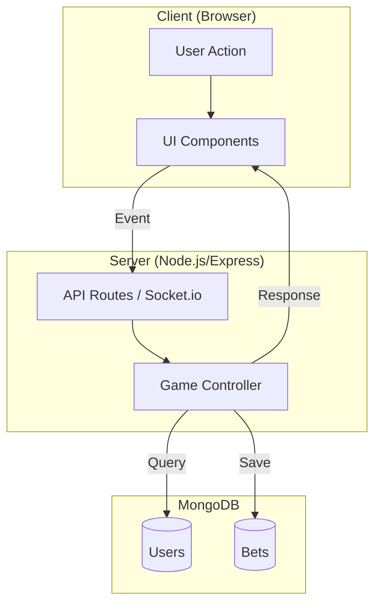

# The Ultimate Developer's Guide to Building "WinZone"

**Welcome, Future Architect.**

This guide is not just a "read-me"; it is a comprehensive manual designed to take you from "I know nothing about this project" to "I can build this from scratch." We will cover the tools, the language (JavaScript), the frameworks (Next.js & Express), and deeply analyze every single folder and file in this codebase.

---

## 📚 Table of Contents

1.  [Introduction & Philosophy](#1-introduction--philosophy)
2.  [Prerequisites & Tools](#2-prerequisites--tools)
3.  [Mastery Roadmap: Skills Required to Build WinZone]  
4.  [The Language: JavaScript (Deep Dive)](#4-the-language-javascript-deep-dive)
5.  [The Architecture: MERN Stack & Next.js](#5-the-architecture-mern-stack--nextjs)
6.  [Part I: The Server (Backend Deep Dive)](#6-part-i-the-server-backend-deep-dive)
7.  [Part II: The Client (Frontend Deep Dive)](#7-part-ii-the-client-frontend-deep-dive)
8.  [The Application Flow: A Request's Journey](#8-the-application-flow-a-requests-journey)
9.  [Step-by-Step Setup Guide](#9-step-by-step-setup-guide)
10. [System Diagrams](#10-system-diagrams)

---

## 1. Introduction & Philosophy

**What is WinZone?**
WinZone is a real-time gaming platform inspired by applications like Aviator. It involves high-concurrency real-time data (game multipliers crashing), user account management (balances, bets), and secure transaction handling.

**Why this Stack?**
We chose the **MERN Stack** (MongoDB, Express, React, Node.js) with **Next.js** for the frontend.
*   **Unified Language:** We use JavaScript (JS) for *everything*. Database queries? JS. Server logic? JS. Frontend UI? JS. This reduces "context switching" for the developer.
*   **Real-Time Capabilities:** Node.js is event-driven and non-blocking, making it perfect for handling thousands of concurrent websocket connections needed for a live game.
*   **SEO & Performance:** Next.js provides Server-Side Rendering (SSR), meaning the user sees content faster and Google can read our pages better than a standard React app.

---

## 2. Prerequisites & Tools

Before writing a single line of code, you need the right tools. Think of these as the hammer and saw for a carpenter.

### 🟢 Node.js
**What it is:** Node.js is a runtime environment that allows you to run JavaScript *outside* of a web browser. Normally, JS only lives in Chrome or Firefox. Node.js lets it run on your server (your computer).
**Check if you have it:** Run `node -v` in your terminal.

### 📦 NPM (Node Package Manager)
**What it is:** A library of code ("packages") written by other people.
**Key Command:** `npm install <package-name>`
**The Manifest:** `package.json` lists every package your project needs.

### 📝 VS Code (Visual Studio Code)
**What it is:** The code editor.
**Extensions to install:** ES7+ React Snippets, Prettier, Tailwind CSS IntelliSense.

### 🐙 Git & GitHub
**What it is:** A time machine for your code.

---

## 3. Mastery Roadmap: Skills Required to Build WinZone

To truly understand this codebase, you shouldn't just memorise lines of code. You need to master the underlying computer science and web development concepts. Here is your curriculum.

### 🎓 1. JavaScript Mastery (The Core)
You cannot build React without solid JS.
*   **The Event Loop:** Understand how Node.js handles multiple users at once without "freezing". It uses a single thread but offloads tasks (like DB queries) to the system.
    *   *Used in:* `server.js` (handling game loops while listening for requests).
*   **Closures & Scope:** How inner functions remember variables from outer functions.
    *   *Used in:* `useEffect` hooks in React that "remember" the game ID.
*   **Destructuring & Spread:** unpacking objects nicely. `const { user } = req.body;`
*   **Asynchronous Patterns:** From Callbacks -> Promises -> Async/Await.
    *   *Used in:* All Database calls (`await User.findOne(...)`).

### 🎓 2. React & Next.js Mastery (The Frontend)
*   **The Virtual DOM:** React keeps a "fake" copy of the HTML. When data changes, it compares the fake copy to the real one and only updates what changed. This is why the timer in Aviator doesn't flash the whole screen.
*   **Reconciliation:** The algorithm React uses to decide *what* to update.
*   **Component Lifecycle (Hooks):**
    *   `Mounting`: When component appears (`useEffect` with `[]`).
    *   `Updating`: When state changes.
    *   `Unmounting`: Cleanup (`return () => socket.disconnect()`).
*   **SSR (Server Side Rendering) vs CSR (Client Side Rendering):**
    *   *SSR:* Page built on server (Home Page, Profiles). Good for SEO.
    *   *CSR:* Page built in browser (Aviator Game). Good for interactivity.

### 🎓 3. Node.js & Backend Mastery (The Backend)
*   **Event Emitters:** Node.js architecture is built on events. "On Connect", "On Data", "On Error".
    *   *Used in:* `socket.io` (listening for `connection` events).
*   **Middleware Pattern:** The "Pipeline". Request -> A -> B -> C -> Response.
    *   *Used in:* Authentication (checking tokens before allowing bets).
*   **RESTful APIs:** Standard verbs (GET for reading, POST for creating).

### 🎓 4. Database Mastery (MongoDB)
*   **NoSQL vs SQL:** Why we use Documents (JSON) instead of Tables. Flexible schema allows us to save complex Game metadata without migration headaches.
*   **Indexing:** Making queries fast.
    *   `UserSchema.index({ email: 1 })`: Tells Mongo to keep a sorted list of emails so login is instant.
*   **Aggregation Pipelines:** Complex math on the database side.
    *   *Used in:* Admin dashboards (Summarizing `TotalBets` per day).

### 🎓 5. WebSocket Mastery (The Heartbeat)
This is the most critical concept for WinZone.
*   **HTTP vs WebSockets:**
    *   *HTTP:* Client asks -> Server answers. Client asks again -> Server answers. (Like a Walkie-Talkie).
    *   *WebSocket:* Connection opens once. Client and Server talk simultaneously anytime. (Like a Phone Call).
*   **The Handshake:**
    *   The connection starts as a normal HTTP request with an `Upgrade: websocket` header. If the server agrees, it switches protocols.
*   **Socket.io:** The library we use. It adds "Rooms" (like chat rooms) and auto-reconnection logic on top of raw WebSockets.
    *   *Room Logic:* `socket.join('game_aviator')` ensures only people watching Aviator get Aviator updates.

---

## 4. The Language: JavaScript (Deep Dive)

This project is built 100% in JavaScript. To understand the code, you must understand these core concepts.

### 🔹 Variables: `const` vs `let`

**Do not use `var` anymore.**

#### `const` (Constant)
Use this for values that **should not be reassigned**.
```javascript
const appName = "WinZone";
// appName = "LoseZone"; // ❌ ERROR! You cannot change a const.
```
*Mental Model:* "This box is sealed. The value inside will stay the same forever."

#### `let`
Use this for values that **will change** later.
```javascript
let score = 0;
score = 10; // ✅ Perfectly fine.
```

### 🔹 Functions: The Arrow Syntax

**New Way (Arrow Function):**
```javascript
const add = (a, b) => {
    return a + b;
};

// Or even shorter for one-liners (Implicit Return):
const add = (a, b) => a + b;
```
**Why?** It's cleaner. In React components, it also handles the `this` keyword lexically.

### 🔹 Object Destructuring & Spread Operator

**Destructuring:** Extracting values from objects.
```javascript
const user = { name: "Alice", age: 25, role: "Admin" };
const { name, role } = user;
// name is "Alice"
```

**Spread Operator (`...`):** Copying or merging objects.
```javascript
const user = { name: "Alice", balance: 100 };
const updatedUser = { ...user, balance: 200 }; 
// updatedUser is { name: "Alice", balance: 200 }
```

### 🔹 Async/Await & Promises

JavaScript is **single-threaded** (it does one thing at a time). But querying a database takes time.

**The Promise:** "I promise I will give you a result later, meanwhile, keep working."

**`async` and `await`:**
This is syntactic sugar to make asynchronous code look synchronous (easy to read).

```javascript
// The keyword 'async' tells JS this function will pause at some point.
const getUserData = async (userId) => {
    try {
        // 'await' asks the engine to PAUSE this function execution
        // until the Promise resolves. The rest of the server KEEPS RUNNING.
        const user = await User.findById(userId); 
        return user;
    } catch (error) {
        console.error("Database failed:", error);
    }
};
```

### 🔹 Array Methods: Map, Filter, Reduce

*   **.map()**: Transform a list. "Take these 5 users and give me 5 names."
    ```javascript
    const names = users.map(user => user.name);
    ```
*   **.filter()**: Select items. "Give me only the users who are active."
    ```javascript
    const activeUsers = users.filter(user => user.isActive === true);
    ```

---

## 5. The Architecture: MERN Stack & Next.js

Our app is a **Web Application**. It has two main parts:

1.  **The Server (Backend)**: resides in the `/server` folder.
    *   **Logic Center:** Calculates wins, stores bets, manages user balances.
    *   **Technologies:** Node.js, Express.js, MongoDB, Socket.io.

2.  **The Client (Frontend)**: resides in the `/client` folder.
    *   **Visual Interface:** What the user sees (buttons, animations, games).
    *   **Technologies:** Next.js, React, Tailwind CSS.

---

## 6. Part I: The Server (Backend Deep Dive)

Let's dissect the `/server` directory.

### 🛠 Express.js Framework
Node.js is raw power. Express is the framework that organizes that power. It lets us create "Routes" (URL endpoints).

### 🛡 Middleware: The Pipeline
Middleware are functions that run **between** the request coming in and the final response going out.

**Scenario:** User requests `/api/get-balance`.
1.  **Request enters Server.**
2.  **Middleware 1 (CORS):** "Is this request coming from our allowed website? Yes? Pass."
3.  **Middleware 2 (Auth):** "Does this user have a valid Token? Are they logged in? Yes? Pass."
4.  **Controller:** "Okay, here is the balance."

### 🗄 MongoDB & Mongoose
*   **MongoDB:** A NoSQL database. It stores data like JSON documents (BSON).
*   **Mongoose:** An ODM (Object Data Modeling) library. It wraps MongoDB with structure.

**What is a Model?** (`/server/src/models`)
```javascript
// User Schema
const UserSchema = new mongoose.Schema({
    username: { type: String, required: true },
    balance: { type: Number, default: 0 }
});
```

### ⚡ Socket.io (Real-Time Magic)
HTTP requests are "Ask and Answer". Socket.io keeps a tunnel open (WebSocket).
This is vital for games like **Aviator** where milliseconds matter.
*   **Server Logic:** "The Multiplier is now 2.00x".
*   **Broadcasting:** The server "shouts" this message to *all* connected clients.

---

## 7. Part II: The Client (Frontend Deep Dive)

Let's dissect the `/client` directory.

### ⚛️ React.js
The library for building User Interfaces (UI).
*   **Components:** We break the UI into LEGO blocks. A "Button" is a component.
*   **JSX:** It looks like HTML, but it's JavaScript.
    ```javascript
    const Button = () => <button className="red">Click Me</button>;
    ```

### 🧠 Next.js
React is just a library. Next.js is a **Framework** built on top of React.
*   **App Router (`/app`):** The file system *is* the router.
*   **Server vs Client Components:**
    *   **Server Components:** Render on the server. Fast, secure interactions.
    *   **Client Components (`'use client'`):** Render in the browser. Interactive (buttons, forms).

### 🎨 Tailwind CSS
We don't write huge CSS files. We use utility classes. `<button className="bg-red-500">`.

### 🎣 Hooks: State Management

#### `useState`
Used for local memory. `const [count, setCount] = useState(0);`

#### `useEffect`
Used for "Side Effects" (doing things when the component loads).
```javascript
useEffect(() => {
    // This code runs ONLY when the component first appears on screen.
    socket.on('crash', handleCrash);
    return () => socket.off('crash');
}, []);
```

---

## 8. The Application Flow: A Request's Journey

Let's trace a user action: **"User Places a Bet in Aviator"**.

1.  **Interaction:** User clicks "BET 100" button (Client).
2.  **Client Logic:**
    *   `BetButton` component fires `onClick`.
    *   **Emits Socket Event:** `socket.emit('place_bet', { amount: 100, gameId: 'aviator' })`.
3.  **Transmission:** The data flies across the internet to the Server.
4.  **Server Logic:**
    *   Socket Listener receives `place_bet`.
    *   **Controller:** Finds User, Checks Balance, Decrements balance, Creates `Bet`.
    *   **Success:** Emits back `bet_accepted`.
5.  **Game Logic:**
    *   The Game Loop (running on server) sees the bet.
    *   If Plane Crash: Server marks all pending bets as "LOST".
6.  **Client Update:** UI updates immediately.

---

## 9. Step-by-Step Setup Guide

1.  **Clone the Repo:** `git clone ...`
2.  **Install Dependencies:** `npm install` (in both folders).
3.  **Environment Variables:** Create `.env` files.
4.  **Run the Server:** `cd server && npm run dev`.
5.  **Run the Client:** `cd client && npm run dev`.
6.  **Visit:** `http://localhost:3000`.

---

## 10. System Diagrams

### 🔷 Entity Relationship Diagram (ERD)

```mermaid
erDiagram
    User ||--o{ Bet : places
    User ||--o{ WalletRequest : requests
    Game ||--o{ Bet : has
    
    User { ObjectId _id, String email, Number balance }
    Bet { ObjectId userId, String gameId, Number amount, String result }
    Game { String gameId, String name, Boolean enabled }
    WalletRequest { ObjectId userId, Number amount, String status }
```

### 🔷 Data Flow Diagram (DFD)



---

**End of Guide**
